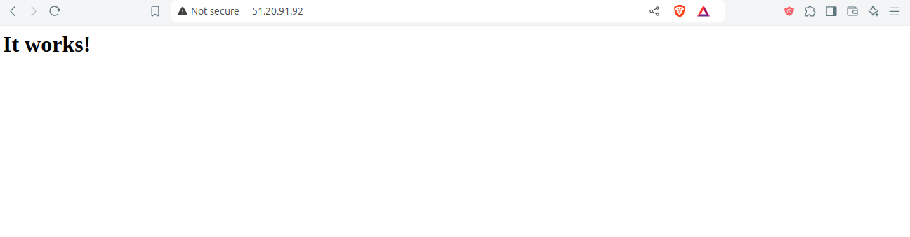
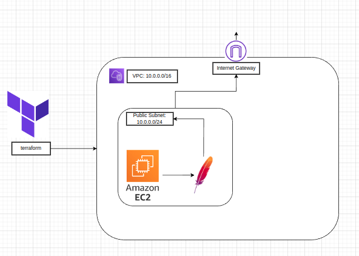
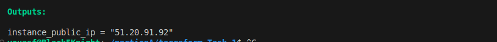

# Terraform AWS Apache Setup

## Introduction

This project demonstrates how to use Terraform to automate the setup of a basic AWS infrastructure. The infrastructure includes a Virtual Private Cloud (VPC), a public subnet, an Internet Gateway, and an EC2 instance with Apache installed. This repository is intended for anyone interested in learning about Infrastructure as Code (IaC) using Terraform and deploying resources on AWS.

## Expected Outcome

After successfully deploying the infrastructure and accessing the EC2 instance via its public IP, you should see the default Apache server page in your browser, as shown below:




## Architecture Diagram

Below is a visual representation of the infrastructure set up by this Terraform code:



## Table of Contents

- [Introduction](#introduction)
- [Expected Outcome](#expected-outcome)
- [Architecture Diagram](#architecture-diagram)
- [Project Structure](#project-structure)
- [Prerequisites](#prerequisites)
- [Installation and Setup](#installation-and-setup)
- [Usage](#usage)
- [Outputs](#outputs)
- [Contact Information](#contact-information)

## Project Structure

The project is organized into the following files and directories:

```plaintext
/terraform-aws-apache-setup/
│
├── /terraform/                 # Contains all Terraform configuration files
│   ├── ec2.tf                  # Configuration for the EC2 instance
│   ├── internet_gateway.tf     # Configuration for the Internet Gateway
│   ├── outputs.tf              # Configuration for Terraform output values
│   ├── provider.tf             # AWS provider configuration
│   ├── script.sh               # Bash script for installing Apache on EC2
│   ├── security_group.tf       # Security Group configuration
│   ├── ssh_key_pair.tf         # SSH Key Pair configuration for EC2 access
│   ├── value.auto.tfvars       # Variable values (keep sensitive information here)
│   ├── variables.tf            # Variable definitions used in the Terraform configurations
│   ├── vpc.tf                  # VPC and Subnet configuration
│
├── README.md                   # Project documentation

```
## Prerequisites

- Terraform installed on your local machine.
- AWS CLI configured with appropriate credentials.

## Installation and Setup

Clone the repository:

```bash
git clone https://github.com/your-username/your-repo-name.git
cd your-repo-name/terraform
```
Initialize Terraform:
```bash

terraform init
```
Plan the infrastructure:
```bash
terraform plan
```
Apply the configuration:
```bash
terraform apply
```

## Usage

After applying the configuration, Terraform will set up the AWS resources as defined. The EC2 instance will have Apache installed, and you can access it using the public IP address provided in the outputs.

## Outputs

After running `terraform apply`, you will get the following output:

- **Public IP Address**: The IP address of the EC2 instance, which you can use to access the Apache server.
  
This screenshot shows the output of the `terraform apply` command, indicating the successful creation of resources:




## Contact Information
For any inquiries or issues, please contact:

Name: Yousef mohamed 

[My LinkedIn Profile](https://www.linkedin.com/in/yousef-mohamed-274a58255/)

